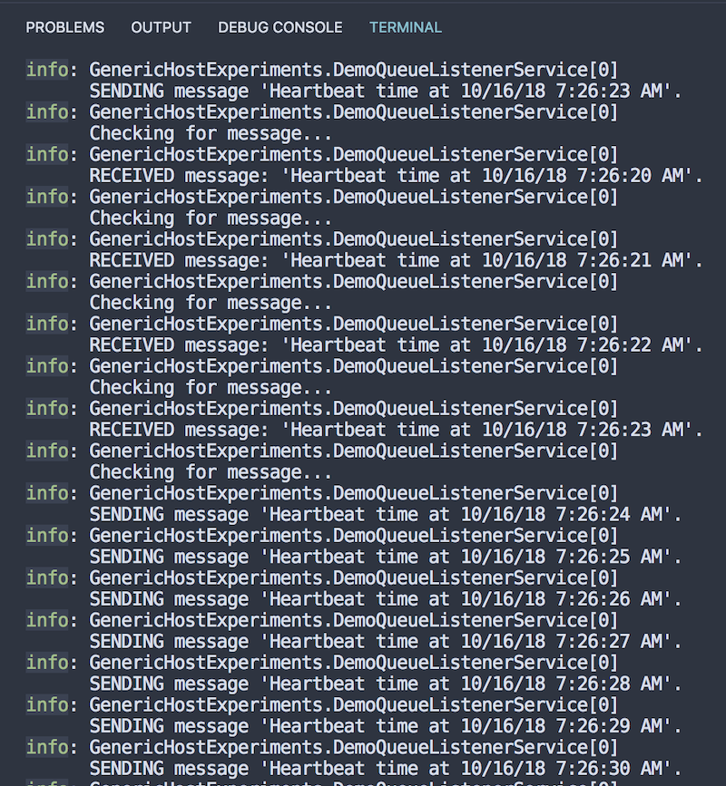

# GenericHost Experiments

After some interesting discussion with my teammates I took a look at the docs for the .NET Core [`GenericHost`](https://docs.microsoft.com/en-us/aspnet/core/fundamentals/host/generic-host?view=aspnetcore-2.1) object to develop some ideas on how I would use it, specifically for Azure scenarios. 

This repository includes some experimental extensions atop the `GenericHost` object. 

## Release Notes

This section will contain updates that occur in reverse-chronological order so you can see the latest experiments first. 

---

## Version 0.0.2.0

This release adds a demonstration for services that would send and receive messages from an Azure Storage Queue. 

> Note: Learn more about using Azure Storage Queues with .NET Core [here](https://docs.microsoft.com/en-us/azure/visual-studio/vs-storage-aspnet5-getting-started-queues). 

### A Service Abstraction for a Storage Queue

Consider the following base class, which implements the [`BackgroundService`](https://docs.microsoft.com/en-us/dotnet/api/microsoft.extensions.hosting.backgroundservice?view=aspnetcore-2.1) class. 

> Note, this class should have some sort of a queue name identifier so "pairs" of feeder/listener classes could work together to send and process messages. 

```csharp
public abstract class DemoAzureStorageQueueService : BackgroundService
{
    public DemoAzureStorageQueueService(ILogger<DemoQueueListenerService> logger,
        IStorageAccountFactory storageAccountFactory)
    {
        Logger = logger;
        StorageAccountFactory = storageAccountFactory;
        StorageAccountFactory.LoadStorageAccounts();
        StorageAccount = StorageAccountFactory.GetAccount("imageStorage");
        CloudQueue = StorageAccount.CreateCloudQueueClient().GetQueueReference("incoming");
    }

    public ILogger<DemoQueueListenerService> Logger { get; internal set; }
    public IStorageAccountFactory StorageAccountFactory { get; internal set; }
    public CloudStorageAccount StorageAccount { get; internal set; }
    public CloudQueue CloudQueue { get; internal set; }
}
```

This way, subclasses can perform the individual responsibilities of sending or receiving to or from a queue. 

Case in point, the following two classes are available in the [`DemoScenario.cs`](DemoScenario.cs) file. Note that each take an argument during construction via .NET Core's dependency injection capabilities of the `IStorageAccountFactory` service, which makes it easy to get to each of the Storage Accounts wired up during the host's build phase. 

### Using the Background Services

These services would be wired up during build-up of the host (an alternative approach, which would decorate the `IHostBuilder` with an extension method, will be added later) using `ConfigureServices`. 

```csharp
var host = new HostBuilder()
    ...
    .ConfigureServices((services) => {
        services.AddLogging();
        services.AddHostedService<DemoQueueListenerService>();
        services.AddHostedService<DemoQueueFeedService>();
    })
    ...
    .UseAzureStorage() // loads from config file (see README.md for other methods)
    .Build();
```

### The Listener Service

This service does the job of watching the Azure Storage Queue and outputting any messages it receives to the logger. 

```csharp
public class DemoQueueListenerService : DemoAzureStorageQueueService
{
    public DemoQueueListenerService(ILogger<DemoQueueListenerService> logger,
        IStorageAccountFactory storageAccountFactory) : base(logger, storageAccountFactory)
    {
    }

    protected override async Task ExecuteAsync(CancellationToken stoppingToken)
    {
        while(!stoppingToken.IsCancellationRequested)
        {
            await CloudQueue.CreateIfNotExistsAsync();

            CloudQueueMessage msg = null;

            Logger.LogInformation("Checking for message...");
            msg = await CloudQueue.GetMessageAsync();
            
            while (msg != null && !stoppingToken.IsCancellationRequested)
            {
                Logger.LogInformation("RECEIVED message: " + msg.AsString);
                await CloudQueue.DeleteMessageAsync(msg);
                msg = await CloudQueue.GetMessageAsync();
            }

            await Task.Delay(TimeSpan.FromSeconds(2), stoppingToken);
        }
    }
}
```

### The Feeder Service

This service does the job of pumping messages into the Azure Storage Queue. 

```csharp
public class DemoQueueFeedService : DemoAzureStorageQueueService
{
    public DemoQueueFeedService(ILogger<DemoQueueListenerService> logger,
        IStorageAccountFactory storageAccountFactory) : base(logger, storageAccountFactory)
    {
    }

    protected override async Task ExecuteAsync(CancellationToken stoppingToken)
    {
        while (!stoppingToken.IsCancellationRequested)
        {
            await CloudQueue.CreateIfNotExistsAsync();
            string msg = string.Format($"'Heartbeat time at {DateTime.UtcNow.ToString()}'.");
            Logger.LogInformation("SENDING message " + msg);
            await CloudQueue.AddMessageAsync(new CloudQueueMessage(msg));
            await Task.Delay(TimeSpan.FromSeconds(5), stoppingToken);
        }
    }
}
```

When properly configured with a live Azure Storage Account, the code will result in output similar to the screen shot below from the code running in Visual Studio Code. 



--- 

## Version 0.0.1.0

This first iteration resulted in adding an extension method to add [Azure Storage](https://docs.microsoft.com/en-us/azure/storage/common/storage-introduction) support. There are a variety of ways Azure Storage can be wired up using the experimental middleware:

### Via Configuration

THe default Azure Storage extension middleware assumes it should read all of the Azure Storage connection strings from configuration. As shown in `Program.cs`, the `UseAzureStorage()` extension method is used with no parameters. 

```csharp
var host = new HostBuilder()
    .UseAzureStorage()
    .Build();
```

This assumes your `appsettings.json` (or environment variables) have been set up with the following style configuration. 

```json
{
    "Azure": {
        "Storage": {
            "documentStorage": "DefaultEndpointsProtocol=https;AccountName=yourstorageaccount01;AccountKey=your_key;EndpointSuffix=core.windows.net",
            "imageStorage": "DefaultEndpointsProtocol=https;AccountName=yourstorageaccount02;AccountKey=your_key;EndpointSuffix=core.windows.net"
        }
    }
}
```

### Via Manual Setup

You can also setup your own accounts during configuration manually. 

```csharp
var host = new HostBuilder()
    .UseAzureStorage(() => { 
        CloudStorageAccount tmp;
        Dictionary<string,CloudStorageAccount> list = new Dictionary<string, CloudStorageAccount>();
        if(CloudStorageAccount.TryParse("DefaultEndpointsProtocol=https;AccountName=yourstorageaccount;AccountKey=YOUR_KEY;EndpointSuffix=core.windows.net", out tmp) && tmp != null)
            list.Add("ImageStorage", tmp);
        return list;
    })
    .Build();
```

### Via Service Implementation

The `IStorageAccountFactory` interface is provided so that you can construct your own implementations that load Azure Storage accounts in other means (say, using the Azure Management Libraries if you want access to all storage accounts in your subscription or in a specific resource group). 

An example implementation is included in this repository, shown below. It simply creates a single Storage Account from a connection string provided at construction. 

```csharp
public class MyExampleIStorageAccountFactory : IStorageAccountFactory
{
    string _connectionString;

    public MyExampleIStorageAccountFactory(string connectionString)
    {
        _connectionString = connectionString;
    }

    public IDictionary<string, CloudStorageAccount> LoadStorageAccounts()
    {
        CloudStorageAccount tmp;
        Dictionary<string,CloudStorageAccount> list = new Dictionary<string, CloudStorageAccount>();
        if(CloudStorageAccount.TryParse(_connectionString, out tmp) && tmp != null)
            list.Add("ImageStorage", tmp);
        return list;
    }
}
```

Then, you can use the implementation during host build-up. 

```csharp
var host = new HostBuilder()
    .UseAzureStorage(new MyExampleIStorageAccountFactory("DefaultEndpointsProtocol=https;AccountName=yourstorageaccount;AccountKey=YOUR_KEY;EndpointSuffix=core.windows.net"))
    .Build();
```

--- 

## Feedback is welcome, contributions appreciated. 

If you think these types of extensions are useful, let us know what others you'd like to see. Submit some issues for new ideas, or send in a pull request if you have any additional ideas or extensions you think might be valuable. 

Happy Coding!
